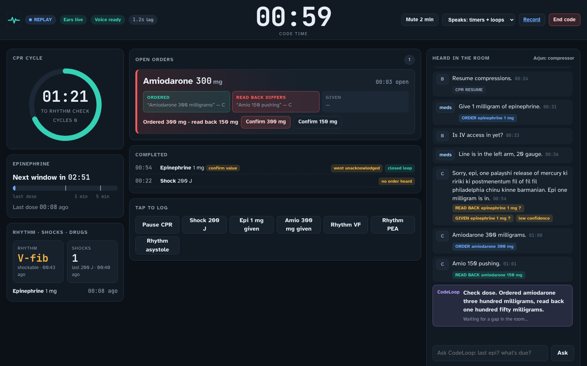
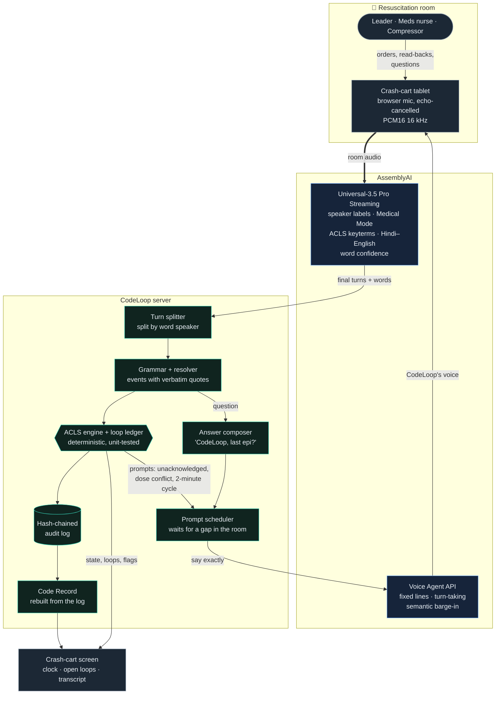
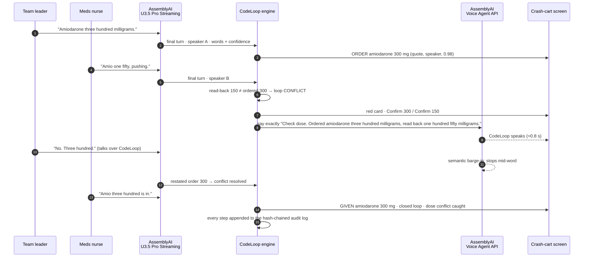

<p align="center">
  
</p>

<p align="center"><b>Every order heard. Every loop closed.</b><br>
The voice recorder for cardiac arrests. Built with AssemblyAI Universal-3.5 Pro Streaming and the Voice Agent API.</p>

CodeLoop is a voice agent that works as the recorder at an in-hospital cardiac arrest. A tablet
on the crash cart listens to the whole resuscitation team. CodeLoop logs every drug, shock and
rhythm with the exact words it heard, runs the ACLS clock out loud, and speaks up when an order
was never confirmed back or a dose was read back wrong. When the code ends, a tamper-evident
Code Record is ready for review.

Built for the AssemblyAI Voice Agent Hackathon 2026, and designed to become a real product.


*A real screenshot from a replayed mock code streamed through AssemblyAI. The leader ordered
amiodarone 300 mg and the read-back was 150 mg. CodeLoop turned the order red, offered one-tap
confirmation and said "Check dose…" out loud.*

> CodeLoop records and keeps time. It never recommends treatment. It is not a medical device,
> and it is intended first for simulation and training.

---

## The problem

A code is run entirely by voice. Hands are on the chest, the airway and the syringes, and
orders fly across the room.

- In 89 filmed pediatric trauma resuscitations, only **26%** of 387 spoken orders were
  closed-loop (repeated back). Closed-loop orders were completed **3.6× sooner**
  ([El-Shafy et al., J Surg Educ 2018](https://www.sciencedirect.com/science/article/abs/pii/S1931720417300387)).
- Hospital records of in-hospital cardiac arrests agree with trained observers on whether
  epinephrine was given within 5 minutes at only **κ = 0.27**
  ([J Clin Med 2023](https://pmc.ncbi.nlm.nih.gov/articles/PMC10672215/)).
- Someone has to stop patient care to write things down. Tap-based recorder apps still need
  free hands, and none of them notice an order that nobody confirmed.

## What CodeLoop does

- **Hears the whole room.** It uses AssemblyAI Universal-3.5 Pro streaming with speaker labels,
  Medical Mode and ACLS keyterms, in English and Hindi–English.
- **Turns speech into events.** Each event carries the exact words it came from: *order*,
  *read-back*, *given*, *cancelled*, rhythm, CPR start and pause, ROSC.
- **Tracks every order as a loop:** ordered → read back → given.
  - Nobody confirms within 10 s: the card turns **amber**, and after 15 s CodeLoop says
    *"Epinephrine one milligram ordered. Not acknowledged."*
  - A different value is read back: the card turns **red**, and CodeLoop says *"Check dose. Ordered
    amiodarone three hundred milligrams, read back one hundred fifty milligrams."*
- **Keeps the ACLS clock.**
  - A 2-minute CPR cycle, with *"Fifteen seconds to rhythm check"* and *"Two minutes. Pause
    compressions for rhythm and pulse check."*
  - The epinephrine 3–5 minute window, the shock count and the amiodarone sequence.
  - A check when a shock is ordered on a non-shockable rhythm.
- **Answers questions.** *"CodeLoop, last epi kab diya tha?"* gets *"Last epinephrine, one
  milligram, three minutes ten seconds ago."* The answer is composed from the record, never
  guessed.
- **Gets out of the way.** CodeLoop waits for a gap in the room before it speaks and stops
  mid-word when a clinician talks over it. The team can mute it or keep it screen-only.
- **Produces the Code Record.** Every entry has a timestamp, speaker, quote and ASR confidence.
  Uncertain items are listed for sign-off, and a SHA-256 hash chain makes any edit detectable.

## How it uses AssemblyAI

Each AssemblyAI feature below guards against a specific failure. We measured most of them.

| AssemblyAI capability | What breaks without it | Evidence |
|---|---|---|
| **Universal-3.5 Pro streaming** | The record lags the code | Event latency p50 **1.1–1.5 s** from end of speech |
| **Medical Mode + ACLS keyterms + context prompt** | Drug names and doses are misheard | Critical entities **96% vs 78%** on identical audio. Without them, the dose conflict was **missed** |
| **Word-level speaker labels** | An order and its read-back look like one person | Turns are split at word-level speaker changes |
| **Word confidence** | A misheard dose silently becomes a fact | Values below 0.6 are marked UNCONFIRMED and listed for sign-off |
| **Hindi–English code-switching** | Indian teams' real talk is lost | Devanagari output is mapped back through a cross-script phonetic layer |
| **Voice Agent API** | A talking bot talks over the team leader | Fixed lines speak in about **0.8 s**; semantic barge-in stops them mid-word |
| **Tight turn detection** (`min/max_turn_silence`) | Answers and nudges come too late | Latency cut about 3× (4.4 s → 1.4 s) with no loss of loop outcomes |

The two AssemblyAI connections do different jobs. The **streaming ears** hear the room. The
**Voice Agent** is CodeLoop's voice. The Voice Agent never hears room chatter: in testing it tried
to answer unaddressed speech out loud. It receives room audio only while it is speaking, so
clinicians can interrupt it. See [docs/spike-findings.md](docs/spike-findings.md).

## Architecture



**How a dose conflict is caught, end to end:**



Module-level detail: [docs/architecture.md](docs/architecture.md).

## Safety by design

The core rule: **models help understand speech; deterministic code decides every state, timer
and number that is shown or spoken.**

- The grammar, resolver, loop ledger and ACLS clock are deterministic and unit-tested. A
  recorded code replays to the same result.
- Every event must quote the transcript verbatim, name a formulary drug and stay within dose bounds.
- A misheard "ROSC" cannot end a code. It pauses the timers until a human confirms.
- CodeLoop's own voice is recognised and ignored if the room microphone picks it up.
- The Code Record is rebuilt from a hash-chained audit log, so the screen and the record cannot
  disagree.

Full safety case, with failure modes and responses: [docs/safety.md](docs/safety.md).

## Evaluation

All audio is **synthetic**: multi-voice TTS mixed with compressions, monitor beeps, alarms and
room reverb. Held-out scenarios were committed before they were measured.

| | Precision | Recall | Loop outcomes |
|---|---|---|---|
| Held-out set 1, first measurement, live AssemblyAI | 0.97 | 0.71 | 5 / 8 |
| Held-out set 2, first measurement, live AssemblyAI | 0.82 | 0.56 | 7 / 9 |
| Both sets after general grammar fixes (no longer held-out), live | 0.96 | 0.88 | 16 / 17 |
| VF demo scenario, live, production settings | 0.97 | 0.91 | 3 / 3 |

Each fresh held-out set found real gaps. Set 2 caught a bug where "one hundred and fifty
joules" became two shocks, and that now has a regression test. The fixes are general rules,
never copied test sentences. The remaining live misses are mostly recognition errors (for example
"two hundred" heard as "100"), which the read-back loop exists to catch.
Protocol, per-scenario numbers and the AssemblyAI A/B: [eval/RESULTS.md](eval/RESULTS.md).

## What is real and what is simulated

| Real | Simulated |
|---|---|
| Live AssemblyAI streaming, diarization, Medical Mode, keyterms, Voice Agent API | The patient, monitor and defibrillator (there are no device integrations) |
| Grammar, resolver, ACLS engine, prompt scheduler, echo guard | Mock-code audio in replay mode is TTS voices, not real clinicians |
| Hash-chained audit log, Code Record, web UI, microphone capture | No EHR or registry connection yet |
| Every number in this README, measured with the scripts in `eval/` | |

## Run it

**Prerequisites:** Python 3.13 with [uv](https://docs.astral.sh/uv/), Node 22 with pnpm, and an
[AssemblyAI API key](https://www.assemblyai.com/dashboard/signup).

```bash
echo "ASSEMBLYAI_API_KEY=your_key" > .env
cd backend && uv sync && uv run python -m codeloop     # API on :8000
cd frontend && pnpm install && pnpm dev                 # UI on :5173 (proxies to :8000)
```

Open http://localhost:5173. **Replay a mock code** streams a recorded mock code through the
live pipeline. **Start live code** uses your microphone. Say "Code blue, starting CPR", then
try "Give one milligram of epinephrine" and stay silent.

**Single-origin production build:** run `cd frontend && pnpm build`, then start the backend. It
serves the UI at http://localhost:8000.

**Docker:**

```bash
docker build -t codeloop .
docker run -p 8000:8000 -e ASSEMBLYAI_API_KEY=... -v codeloop-data:/data codeloop
```

On a network with TLS inspection (a corporate proxy), pass your CA bundle as a build
secret. It is used only to download dependencies and is never copied into the image:
`docker build --secret id=ca,src="$SSL_CERT_FILE" -t codeloop .`. At runtime, mount it too:
`-v "$SSL_CERT_FILE":/etc/ssl/ca.pem:ro -e SSL_CERT_FILE=/etc/ssl/ca.pem`.

| Environment variable | Default | Purpose |
|---|---|---|
| `ASSEMBLYAI_API_KEY` | (required) | Server-side only; never sent to the browser |
| `ACCESS_TOKEN` | unset | When set, every API and WebSocket call must present it |
| `PROMPT_POLICY` | `timers_and_loops` | Or `timers`, or `silent` (screen only) |
| `MAX_CONCURRENT_CODES` | `4` | Cost and abuse limit |
| `MAX_CODE_MINUTES` | `60` | Capture stops after this long |
| `DATABASE_PATH` | `data/codeloop.db` | Audit log (put it on a volume) |
| `MIN_TURN_SILENCE_MS` / `MAX_TURN_SILENCE_MS` | `160` / `640` | Turn detection (measured trade-off) |

**Tests and evaluation:**

```bash
cd backend && uv run pytest -q                                  # 131 tests
uv run --project backend python eval/run_text_eval.py           # perfect-transcript scores
uv run --project backend python eval/capture.py eval/audio/*.ward.wav   # live captures (needs key)
uv run --project backend python eval/run_eval.py spikes/results/streaming.*.product.raw.json
```

## Repository map

```
backend/src/codeloop/
  aai/          AssemblyAI clients: streaming ears, voice agent, turn splitting
  extract/      grammar, numbers, phonetic cross-script matching, resolver
  engine/       ACLS engine + loop ledger, spoken-number rendering, answers
  session.py    per-code orchestration (scheduling, echo guard, controls, replay)
  store.py      hash-chained audit log      record.py   Code Record
  api/app.py    REST + WebSocket API
frontend/src/   crash-cart UI (React + TypeScript)
eval/           scenario scripts, audio synthesis, capture, scoring, RESULTS.md
demo/scenarios/ replayable mock codes
docs/           architecture, safety case, spike findings, research
```

## Cost

About **$2.66 of AssemblyAI usage per 30-minute code** at list prices: streaming with Medical Mode,
speaker labels and Voice Focus, plus a Voice Agent session. See
[docs/architecture.md](docs/architecture.md).

## Roadmap

1. **Simulation centres.** Recorded mock codes with real clinicians, and debrief timelines. This is
   also where accuracy on real voices gets measured.
2. **Documentation assist.** Recorder-nurse sign-off, FHIR export and GWTG-Resuscitation registry
   fields.
3. **Real-time assist on live codes.** Requires clinical validation and a regulatory pathway
   (SaMD).

Next up: defibrillator data merge (shocks, CPR quality), pediatric weight-based checks, more
languages, and per-role microphones for better speaker attribution.

## License

MIT. See [LICENSE](LICENSE).
