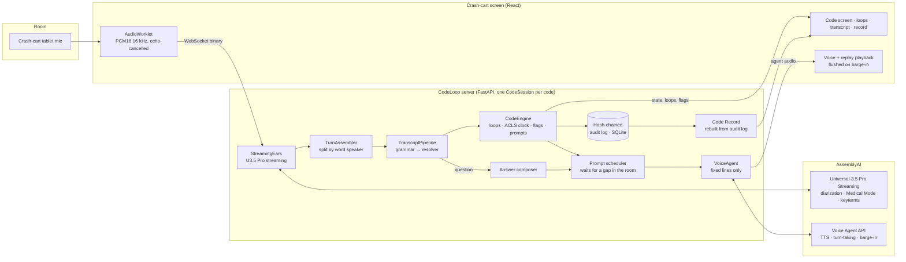

# Architecture

## Components

| Module | Responsibility |
|---|---|
| `aai/streaming.py` | U3.5 Pro client: speaker labels, `domain=medical-v1`, ACLS keyterms from the formulary, context prompt, far-field Voice Focus, 160/640 ms turn silence; buffered reconnect with timestamp rebasing |
| `aai/turns.py` | Splits each final turn wherever the word-level speaker changes |
| `extract/grammar.py` | Deterministic event extraction (English, romanized Hindi, Devanagari), verbatim quotes, per-event ASR confidence |
| `extract/phonetic.py` | Cross-script phonetic keys so "रिदम चेक" matches "rhythm check" |
| `extract/numbers.py` | Spoken doses and energies ("three zero zero", "one fifty", "dedh sau") |
| `extract/resolve.py` | Resolves bare mentions and values against engine state; validation gates |
| `engine/engine.py` | Closed-loop ledger and ACLS clock; no I/O, fully deterministic |
| `engine/answers.py` | Deterministic answers to "CodeLoop, …" questions |
| `engine/speech.py` | Numbers, doses and durations as unambiguous spoken English |
| `aai/voice.py` | Voice Agent API client: only speaks given lines, mutes unsolicited replies, barge-in, session resume |
| `session.py` | Per-code orchestration: prompt scheduling, echo guard, controls, replay, broadcast, audit |
| `store.py` | Append-only SHA-256 hash-chained audit log |
| `record.py` | Code Record from the audit log, with integrity status |
| `api/app.py` | REST + WebSocket API, access token, limits, SPA hosting |

## Timing

- Audio is sent to AssemblyAI in 100 ms chunks.
- Final turns arrive about 0.6 s after the end of speech (U3.5 Pro, tight turn silence).
- Grammar, resolver and engine run in well under 1 ms per turn.
- Measured end to end, speech end → event on screen: p50 about 1.1–1.5 s, p90 about 1.5–2.1 s on the evaluation captures.
- Engine prompts are spoken about 0.8 s after the Voice Agent is asked (first audio), once the room is quiet.

## Protocol (browser ↔ server)

See the header of `backend/src/codeloop/api/app.py` for message types. Binary frames carry audio:
`0x01` + PCM16 16 kHz room audio (replays), `0x02` + PCM16 24 kHz CodeLoop voice. Browser → server
binary frames are microphone PCM16 16 kHz.

## Cost per code (AssemblyAI list prices, Sept 2026)

| Item | Rate |
|---|---|
| U3.5 Pro streaming | $0.45 / h |
| Medical Mode | + $0.15 / h |
| Speaker labels | + $0.12 / h |
| Voice Focus | + $0.10 / h |
| Voice Agent API (session time) | $4.50 / h |
| **30-minute code** | **≈ $2.66** |
